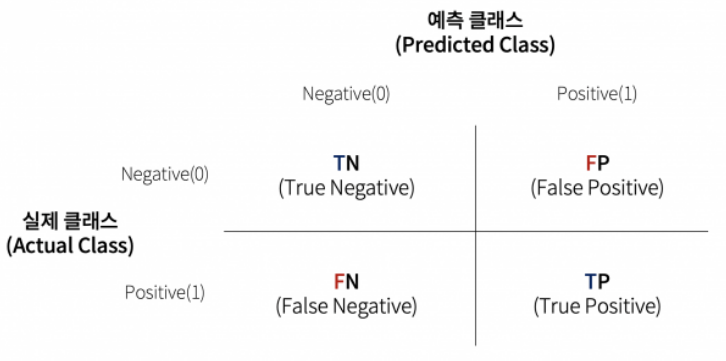

# 분류

- 일반적으로 binary class를 구분하는 문제
- 일반적인 분류 문제 접근 순서
    1. 레코드가 속할 것이라고 생각되는 관심 클래스에 대한 컷오프 확률을 정한다.
    2. 레코드가 관심 클래스에 속할 확률을 추정한다.
    3. 그 확률이 컷오프 확률 이상이면 관심 크래스에 이 레코드를 할당한다.
    4. 컷오프가 높을수록 1로 분류되는 레코드가 적어진다.

- 클래스가 두 개 이상일 때에는
    - 복수개의 클래스를 이진 문제로 변환하고
    - 나눈 결과를 다시 분류하는 방식으로 해결할 수 있다.

## 나이브 베이즈

용어 정리

- 조건부확률(conditional probability): 어떤 사건이 주어졌을 때, 해당 사건을 과찰할 확률 P(X|Y)
- 사전확률(posterior probability): 예측 정보를 통합한 후 결과의 확률 (사전확률에서는 예측변수에 대한 정보를 고려하지 않음)

---

- 나이브 베이즈 알고리즘은
    - 주어진 결과에 대해 예측변수 값을 관찰할 확률을 사용하여,
    - 예측변수가 주어졌을 때, 결과 *Y* = *i*를 관찰할 확률을 추정
- 나이브하지 않은 베이지언 분류는 아래와 같을것이다.
    1. 예측변수 프로파일이 동일한 ( 예측변수 값이 동일한) 모든 레코드를 찾음
    2. 해당 레코드들이 가장 많이 속한 (가능성이 가장 많은)클래스를 정함
    3. 새 레코드에 해당 클래스를 지정
- 모든 예측변수들이 동일하다면 같은 클래스에 할당될 가능성 높음
    - 표본에서 새로 들어온 레코드와 일치하는 데이터를 찾는 것에 중점

### 나이브하지 않은 베이지언 분류는 왜 현실성이 없을까?

- 데이터가 많으면 서로 완전히 일치하는 경우가 거의 없다.
- 나이브 베이즈는 베이지언 통계의 방법으로 간주되지 않는다.
    - 통계 지식이 거의 필요 없는 데이터 중심의 경험적 방법이다.
    - 단지, 베이즈 규칙과 비슷한 예측 계산이 들어가서 이름이 '나이브 베이즈'라고 지어짐.

### 나이브한 해법

- 나이브 베이즈는 위의 방법과 달리, 전체 데이터를 활용함.
- 공식 설명: p.202, **이해 안 됨...**
- 나이브 베이지언 분류기는 편향된 추정 결과를 예측하는 것으로 알려져있음
    - Y=1인 확률에 따라 레코드들에 순위를 매기는 것이 목적
    - **확률의 비편향된 추정치를 구할 필요가 없다면**, 나이브 베이즈도 성능 우수
    -

### 수치형 예측변수

- 베이지언 분류기는 예측변수들이 범주형인 경우 적합
- 수치형 변수에 나이브 베이즈를 적욯하기 위해서는 두 가지 접근법 중 하나를 따라야 함.
    1. 수치형 예측변수를 binning하여 범주형 변환 후 알고리즘 적용
    2. 조건부확률을 추정하기 위해 정규분포같은 확률모형 사용

- 주요 개념
    - 나이브 베이즈는 예측변수와 결과변수 모두 범주형이어야함
    - 각 출력 카테고리 안에서, 어떤 예측변수의 카테고리가 가장 가능성이 높은가?
    - 이 정보는 주어진 예측변수 값에 대해 결과 카테고리의 확률을 추정하는 것으로 바뀜

## 판별분석 (discrminant analysis)

용어 정리

- 공분산(covariance): 하나의 변수가 다른 변수와 함께 변화하는 정도(크기, 방향)를 측정하는 지표
- 판별함수(discriminent function): 예측변수에 적용했을 때, 클래스 구분을 최대화하는 함수
- 판별 가중치(discriminant weight): 판별함수를 적용하여 얻은 점수, 어떤 클래스에 속할 확률을 추정할 때에 사용

---

- 가장 일반적으로 사용되는 판별분석은, **선형판별분석**(**LDA**, linear discriminant analysis)
    - 트리, 로지스틱회귀 등 더 정교한 기법이 나온 후로는 잘 사용되지 않음
    - 하지만, 주성분분석 등에서 연결되어 사용
    - 예측변수들의 중요성 측정이나, 효과적으로 특징을 선택하는 방법으로도 사용

### 공분산행렬

- 공분산이란, 두 변수 x와 z사이의 관계를 의미하는 지표
- 수식: (Σ(x 오차)(z 오차)) / n-1
- 상관관계와 마찬가지로, 양수는 양의 관계, 음수는 음의 관계
    - 범위는 공분산은 변수 x와 z에서 사용하는 척도와 동일한 척도에서 정의됨
        - (상관관계는 -1~1)
- 공분산행렬 Σ는 [[x의 분산, x,z의 공분산], [x,z의 공분산, z의 분산]] 형태
    - 대각 행렬에 변수 x의 분산, z의 분산, 비대각 행렬에 x, z의 공분산

### 피셔의 선형판별

- 그룹 안의 편차와 다른 그룹 간의 편차를 구분
- 레코드를 두 클래스로 나누는 방법을 찾기 위해,
- LDA는 '내부'제곱합 SS내부 (그룹 안 변동 측정)에 대한 '사이'제곱합 SS사이(두 그룹 사이의 편차 측정)의 비율을 최대화하는 것을 목표로 함
    - 두 그룹은, y=0에 대해 (x0, z0), y=1에 대해 (x1, z1)으로 나뉘게 됨
    - 이 방법은 SS사이 / SS내부 비율을 최대화하는 선형 결합 w(x)x + w(z)z를 찾음
- 사이 제곱합의 각 값은 두 그룹 평균 사이의 거리 제곱
- 내부 제곱합의 각 값은 각 그룹 내의 평균을 주변으로 퍼져있는 정도
- SS사이 를 최대화하고, SS내부 를 최소화하는 것이 두 그룹 사이를 가장 명확히 나누는 방법임

- **주요 개념**
    - 판별분석은 예측변수나 결과변수가 범주/연속에 구애받지 않고 잘 동작
    - 공분산행렬을 사용하여 각 클래스를 구분하는 선형판별함수를 계산할 수 있음.
    - 이 함수를 통해 각 레코드가 어떤 클래스에 속할 가중치 혹은 점수를 구함

## 로지스틱회귀

용어 정리

- 로짓(logit), 로그 오즈: +-무한대 범위에서 어떤 클래스에 속할 확률을 결정하는 함수
- 오즈(odds): 실패(0)에 대한 성공(1)의 비율
- 로그 오즈(log odds): 변환 모델의 응답변수, 이 값을 통해 확률을 구함

---

- 나이브 베이즈 모델이나 KNN 모델과는 다르게, 데이터 위주의 접근 방식이 아닌 **구조화된 모델 접근 방식**
- 빠른 계산 속도, 빠른 점수 산정의 장점이 있음

### 로지스틱 반응 함수와 로짓

- 이 문제를 결과변수를 이진값으로 생각하지 말고,
- 라벨이 1이 될 확률 p로 생각
    - p = b0 + b1x1 + b2x2 ... bqxq로 모델링 시, p가 0과 1 사이로 딱 떨어지지 않을 수 있음, 더 이상 확률이라고 할 수 없게 됨
- 대신, 예측변수에 로지스틱 반응 혹은 역 로짓 함수를 적용하여 p를 모델링
    - [링크](https://soobarkbar.tistory.com/12)
- 위 변환을 통해 p는 항상 0과 1 사이에 온다.
- 위 식에서 분모의 지수를 구하려면 오즈비를 이용
    - 오즈비: 성공 확률 / 실패 확률(=1-성공 확률)
- 역 오즈비 함수를 통해, 확률값을 구할 수 있다.
    - p = 오즈 / 1+오즈
- 오즈 수식을 로지스틱 반응 함수에 적용 후, 양 변에 로그함수를 취하면, 예측변수에 대한 선형 함수를 얻을 수 있다.
- 그 함수를 통해, 컷오프 기준을 이용, 그 값보다 큰 확률값이 나오면 1로 분류 가능

### 일반화선형모델 (GLM, generalized linear model)

- 다음 두 가지 주요 구성 요소로 특징지어짐
    - 확률분포 또는 분포 (로지스틱 회귀는 이항분포)
    - 응답을 예측변수에 매핑하는 연결 함수 (로지스틱 회귀의 경우 로짓)
- 푸아송 분포
    - 일반적으로 카운트 데이터 (유저가 일정 시간 동안 웹 페이지를 방문한 수)
- 음이항분포, 감마 분포
    - 고장 시간과 같은 경과 시간을 모델링하는 데 사용
- 위 모델들을 GLM에 적용하는 것은 더 미묘한 차이를 발생시키므로, 주의 필요!

~~사실, 잘 이해 안 됨...p. 214~~

### 로지스틱 회귀의 예측값

- 로지스틱 회귀에서 예측하는 값은 로그 오즈에 관한 값이다.
- 예측된 확률은 로지스틱 반응 함수에 의해 주어진다.
- 근데 예측된 값들이 클래스0인지 클래스1인지 말해주는 것은 아니다.
- 0.5보다 크면 클래스 1, 작으면 0으로 하는 등의 기준이 있어야하고,
    - 희귀한 클래스에 속한 데이터를 확인하는 것이 목표라면 기준값을 엄격하게 두는 것도 하나의 방법이다.

### 계수와 오즈비 해석

- 오즈비를 이해하는 것이 가장 중요.
- 이진 분류 문제일 때 오즈비가 2이면, Y=1의 오즈가 Y=0일 때 보다 두 배 더 높다는 것.
- 왜 오즈비를 사용하나?
    - 로지스틱 회귀분석에서 계수 *B*는 X에 대한 오즈비의 로그값이기 때문

부분적으로 이해 잘 안 됨 → p.216

### 선형회귀와 로지스틱 회귀: 유사점과 차이점

- 두 가지 모두 예측변수와 응답변수를 선형 관계로 가정한다는 점 등 유사점이 많지만,
- 두 가지 근본적인 차이점이 있다.
    - 모델 피팅 방식 (최소제곱 사용할 수 없다.)
    - 모델에서의 잔차와 특징의 분석

- 모델 피팅
    - 선형회귀
        - 모델 피팅을 위해 최소제곱을 사용
        - RMSE와 R²를 사용하여 성능 평가
    - 로지스틱 회귀
        - 최대우도측정(MLE, maximum likelihood estimation)을 사용하여 피팅
            - 우리가 보고 있는 데이터를 생성했을 때, 가능성이 가장 큰 모델을 찾는 프로세스
        - 로지스틱 회귀식에서 응답변수는 0, 1이 아닌, Y=1인 로그 오즈비의 추정치
        - MLE는 예상 로그 오즈비가 관찰된 결과를 가장 잘 설명하는 모델을 찾는다.
    - 어느정도 이해만 하고 넘어가자!
    - 대신 MLE가 무엇인지는 알고 넘어가자!

### 모델 평가

- 얼마나 정확하게 분류하는가를 기준으로 평가
- p값을 해석할 때, 통계적인 유의성을 측정하는 지표로 보기보다는,
    - 변수의 중요성을 나타내는 상대적인 지표로 봐야 함.
- 이진 응답변수가 있는 로지스틱 회귀모형은, RMSE나 R²가 있을 수 없다.
- 편잔차는 회귀에서보다는 덜 중요하지만,
    - 비선형성을 검증하고 영향력이 큰 레코드들을 확인하는 데 여전히 유용

**주요 개념**

- 로지스틱 회귀는 이진변수 출력이라는 점을 제외하면, 선형 회귀와 매우 비슷
- 다만 선형 모형과 비슷한 형태로 만들기 위해, 오즈비의 로그값을 사용하는 등의 변환 필요
- 선형모형을 피팅하고 나면, 로그 오즈비는 다시 확률값p로 변환
- 계산이 빠르고, 새로운 데이터에 대해 빠르게 결과를 알 수 있다는 장점으로 인해 자주 쓰임.

## 분류 모델 평가

용어 정리

- 정확도(accuracy): 정확히 분류된 비율
- 혼동행렬(confusion matrix): 예측된 결과와 실제 결과에 대한 레코드 개수를 표시한 R*C
- 재현율(recall)=민감도(sensitivity): 정확히 분류된 1의 비율
- 특이도(specificity): 정확히 분류된 0의 비율
- 정밀도(precision): 정확히 1이라고 예측된 1의 비율
- ROC곡선: 재현율과 특이성을 표시한 그림
- 리프트(lift): 모델이 다른 컷오프에 대해 1을 얼마나 잘 분류하는지 나타내는 측정 지표

---

- 대부분의 분류 알고리즘에서는 각 데이터에 대해 1이 될 확률값을 추정하여 할당
- 가장 기본적인 컷오프값은 0.5
- 정확도 = (참 양성 + 참 음성) / 표본크기

### 혼동행렬

- 분류 결과를 나타내는 가장 대표적인 행렬
- 행렬의 (1,1), (2,2)가 참 결과값을 나타냄.
- 클래스1이 희박할 때에, 거짓 양성 비율이 높아질 수 있는데,
    - 이럴 경우 클래스는 1로 분류되었지만 실제로는 0일 확률이 더 높음

### 희귀 클래스 문제

- 현실에서의 많은 문제들은 희귀 클래스 분류 문제가 많음
    - [방문자, 구매자] 등과 같은 문제들 등
- 알고싶은 (희귀한) 클래스가 1이라고 할 때,
    - 분류기가 모든 레코드를 0이라고 예측하면 정확도는 올라가지만,
    - 실제로는 쓸모가 없음.
    - 오히려 정확도가 비교적 떨어지더라도, 재현율이 높은 모델이 효과적일 수 있음

### 정밀도, 재현율, 특이도

- 정확도 외에 분류 모델 성능을 표현하기 위해 다양한 지표들이 있음
- 정밀도
    - 양성(클래스1)으로 분류한 레코드 중 진짜 양성
    - TP / (TP+FP)
- 재현율, 민감도
    - 양성 데이터에 대해 정확히 양싱이라고 예측하는 결과의 비율
    - TP / (TP+FN)
- 특이도
    - 음성 결과를 정확히 예측하는 능력
    - TN / (TN+FP)

### ROC곡선

- 재현율과 특이도 사이에는 트레이드오프 관계가 있음.
    - 양성을 잘 잡아내면, 그만큼 0을 1로 잘못 분류할 가능성이 높아지는 것을 의미하기도 하기 떄문
- 이 관계를 잘 표현하기 위한 지표가 '수신자 조작 특성' 곡선 (Receiver Operating Characteristic)
    - ROC곡선
    - *2차 세계대전 중 레이더 신호를 정확히 분류해, 적기 출현을 방위 부대에 미리 알리기 위한 목적으로 수신국의 성능을 올리는 데에 처음 사용되었다고 한다.*
- x축의 특이도에 대한 y축의 재현율을 표시
- 계산 과정
    1. 1로 예측할 확률에 따라 가장 1이 되기 쉬운 것부터 1이 되기 어려운 순으로 레코드 정렬
    2. 정렬된 순서대로 점증적으로 특이도와 재현율 계산

### AUC

- ROC 곡선 자체로도 모델 성능을 확인할 수 있지만, 하나의 지표로 나타내주지는 못한다.
- ROC 곡선 아래 면적 (Area Underearth the Curve)라는 지표를 통해 지표를 구할 수 있다.
    - AUC

- AUC값이 높을수록 더 좋은 분류기
    - 값이 1이면, 거짓 양성, 거짓 음성으로 예측하는 일 없이 완벽하게 분류해내는 분류기
    - 최악의 경우, 0.5인 경우

### 리프트

- 모델의 확률 컷오프를 기본값인 0.5가 아닌, 0.4나 0.3 등으로 낮춰, 희귀 케이스 문제를 해결할 수 있다.
- 최적의 컷오프는 무엇일까?
- 상위 10% 레코드를 1로 분류하는 알고리즘과 무작위로 1로 분류한 알고리즘을 비교해보자.
    - 무작위: 0.1% 정확도, 상위10%에서 0.3%의 정확도를 가질 때,
    - 이 알고리즘은 상위 10%에서 3의 리프트(혹은 이득(gain))를 갖는다고 할 수 있다.
    - 이 값은 매 십분위수마다 혹은 데이터 범위에서 연속적인 값을 따라 얻을 수 있다.
- 레코드를 1로 분류하기 위해 적합한 컷오프 값을 결정하기 위한 중간 단계로 활용 가능

**주요 개념**

- 분류기의 기본적인 평가 지표는 **정확도**
- 재현율, 특이도, 정밀도는 더 세부적인 성능을 보여준다.
    - 희귀한 데이터들에 대해 적합하다.
- AUC는 모델의 1과 0을 구분하는 능력을 보여주기 위해 가장 보편적으로 사용되는 지표
- 리프트는 모델이 얼마나 1일 효과적으로 분류하는지 측정한다.
    - 가장 1로 분류될 가능성이 높은 것부터 매 십분위마다 이를 계산한다.

## 불균형 데이터 다루기

**용어 정리**

- 과소표본(undersample, downsample): 분류 모델에서 개수가 많은 클래스 데이터 중 일부 소수만 사용
- 과잉표본(oversample, upsample): 분류 모델에서 희귀 클래스 데이터를 중복해서, 필요하면 부트스트랩하여 사용하는 것
- 상향 가중치, 하향 가중치 (up, down weight): 모델에서 희귀(혹은 다수) 클래스에 높은(낮은) 가중치를 주는 것
- 데이터 생성(data generation): 부트스트랩과 비슷하게, 다시 샘플링한 레코드를 빼고 원본과 살짝 다르게 데이터를 생성하는 것
- z-점수(z-score): 표준화 결과

### 과소표본추출(다운샘플링)

- 데이터 수가 충분하다면, 다운샘플링을 통해 0과 1의 데이터 수의 균형을 맞출 수 있음
    - 이 아이디어는 다수 클래스에 속한 데이터 중 중복 레코드가 많을 것이라는 사실에서 시작
    - 작지만 균형잡힌 데이터는 모델 성능에 영향을 주고, 모델링 과정에서도 도움을 준다.
- 어느 정도의 데이터가 '충분'한가?
    - 도메인마다 다르지만, 보통 소수 클래스 데이터가 수만 개 정도 있으면 충분하다고 가정한다.

### 과잉표본추출(업샘플링)과 상향/하향 가중치

- 다운샘플링은 버려지는 데이터가 생겨서, 전체 데이터를 활용하지 못한다는 단점이 있음
- 위의 원인으로 인해 다수 클래스에 대한 유용한 정보까지 손실될 위험이 있다면,
    - 복원추출 방식(부트스트래핑)으로 희귀 클래스 데이터를 업샘플링해야한다.
- 데이터에 가중치를 적용하는 방식으로 이와 비슷한 효과를 얻을 수 있다.

### 데이터 생성

- 업샘플링의 변형으로, 원본 데이터를 살짝 바꿔 새 레코드를 바꾸는 **데이터 생성 방법**이 있음
- 이 방법의 배경엔, 데이터의 수가 제한적이기 때문에, 알고리즘을 통해 분류 '규칙'을 세우기에는 정보가 불충분하다는 직관이 깔려있음
- 비슷하지만 기존의 데이터와 다른 데이터를 생성하여, 보다 로버스트한 규칙을 학습할 수 있도록 하는 것
    - 부스팅, 배깅 등에 담긴 개념과 매우 비슷
- SMOTE알고리즘 (Synthetic Minority Oversampling Technique)
    - 업샘플링된 레코드와 비슷한 레코드를 찾고
    - 원래 레코드와 이웃 레코드의 랜덤 가중평균으로 새로운 합성 레코드를 생성
    - 여기에 각각 예측변수에 대해 개별적으로 가중치 생성
    - 새로 합성된 업샘플 레코드의 수는 데이터 균형을 맞추기 위해 필요한 업샘플링 비율에 따라 달라짐

### 비용 기반 분류

- 실무적으로, 정확도, AUC등의 지표가 불충분할 수 있다.
- 실제 예측될 결과들이 어떤 비용들을 가져오는지(금전적인) 고려하는 것도 좋은 방법이다.

**주요 개념**

- 데이터의 불균형 (다수 레코드 클래스 vs 희소 데이터 클래스)은 분류 알고리즘에서 문제가 될 수 있음
- 다운샘플링을 통해 다수의 데이터를 줄이거나,
- 업샘플링을 통해 희소한 데이터를 생성하여 균형을 맞출 수 있음
- 갖고있는 1의 데이터를 모두 사용해도 그 수가 너무 작으면,
    - 희귀한 데이터에 부트스트랩 방식을 사용하거나,
    - 기존 데이터와 유사한 합성 데이터를 만들기 위해 SMOTE 사용
- 불균형이 존재하면, 보통 클래스1을 정확히 분류하는 것에 더 높은 점수를 주게 되어 있으며
    - 이러한 가치 비율이 평가 지표에 반영되어야함
