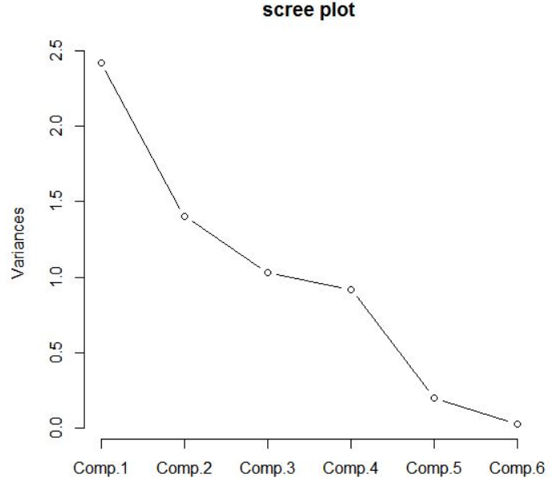

# 비지도 학습

- 비지도 학습
    - 레이블링된 데이터 없이, 데이터로부터 의미를 이끌어내는 통계적 기법
    - 지도 학습과 마찬가지로 데이터로부터 모델을 만드는 것이 목적이지만,
        - 응답변수 - 예측변수 간 구분이 없다.

## 주성분분석

**용어 정리**

- 주성분(principal component): 예측변수들의 선형결합
- 부하(loading)(=가중치): 예측변수들을 성분으로 변형할 때 사용되는 가중치
- 스크리그래프(screeplot): 성분들의 변동을 표시한 그림. 성분들의 상대적인 중요도를 보여줌

---

- 변수들은 흔히 함께 변한다. (공변)
    - 어느 한 변수에서 일바 분화는 실제로 다른 변수에서의 변화에 의해 중복되기도 한다.
- PCA는 수치형 변수가 어떤 식으로 공변하는지 알아내는 기법
    - 주요 아이디어는 다수의 수치형 변수들을 더 적은 수의 변수들의 집합으로 나타내는 것
    - 이 집합을 **주성분**이라고 하며,이를 이용해 데이터의 차원을 축소할 수 있다.
    - 주성분을 만드는 데 사용되는 가중치들은, 각 변수들이 주성분 생성 기여 정도를 나타냄
- 변수 X1과 X2에 대해 두 주성분 Zi(i=1 or 2)가 있다면, 수식은 아래와 같다.

    $$Z_{i} = w_{i,1}X_{1} + w_{i,2}X_{2}$$

- 가중치 w를 주성분의 부하라고 한다.
    - 첫 주성분이 0.5, 0.6이라고 했을 때, 이 주성분이 -0.5, -0.6인 것과 다르지 않다.
    - 방향이 중요한것이기 때문에.

### 주성분 계산

- 데이터가 두 개 이상으로 확장될 때에도 방식은 간단함.
    - 예측변수들의 공변동 집합이 최적화되도록 가중치를 할당하면 된다.
- 데이터의 상관행렬 혹은 공분산행렬을 구하는 방식이며, 전체 과정은 아래와 같다.
    1. 첫 번째 주성분을 구하기 위해, PCA는 전체 변동을 최대한 설명하기 위한 예측변수의 선형 결합을 구한다.
    2. 이 선형결합은 첫 번째 새로운 예측변수 Z1이 된다.
    3. 같은 변수들을 이용해 새로운 두 번째 변수 Z2를 만들기 위해, 다른 가중치를 가지고 과정을 반복. 가중치는 Z1과 Z2가 서로 상관성이 없도록 결정
    4. 원래 변수 Xi의 개수만큼 새로운 변수 Zi를 구할 때까지 이 과정을 계속한다.
    5. 대부분의 변동을 설명하기 위해 필요한 만큼의 주성분을 선택하여 남긴다.
    6. 결과적으로 각 주성분에 대한 가중치 집합을 얻게된다.
        - 데이터에 가중치를 적용하여 새로운 주성분으로 변형
        - 위에서 얻은 새로운 값들을 예측변수들의 차원이 축소된 형태로 사용 가능

### 주성분 해석

- 주성분들의 특징으로부터 데이터 구조에 대한 정보를 얻을 수 있다.
- 이를 이해하기 위한 시각화 방법으로는 크게 두 가지가 있다.
    1. 스크리그래프
        - 그림이 마치 절벽이 있는 산비탈(scree slope)와 흡사

            

    2. 상위 주성분들의 가중치를 표시해보기
        - 각 주성분에서 특성들이 어떤 방향성을 띄고있는지 알 수 있다.
- 성분을 몇 개까지 골라야할까?
    - 차원 축소가 목적이라면, 주 성분을 몇 개까지 고를 것인지 선택해야한다.
        1. 스크리 그래프 활용하기
        2. 누적 분산이 특정값을 넘어가도록 하는 상위 주성분 선택 (예를들어 80% 등)
        3. 부하를 살펴보며 직관적인 해석이 가능한 성분들이 있는지 확인
        4. 교차타당성 검사는 중요한 주성분 수 결정을 위한 공식적인 방법

**중요 개념**

- 주성분은 예측변수들의 선형결합이다.
    - 이 때, 예측변수는 수치형
- 주성분들은 서로 간 상관관계가 최소화되며 중복성이 줄어들도록 한다.
- 제한된 개수의 주성분들로도 결과변수에서 대부분의 변동을 설명할 수 있다.
- 제한된 개수의 주성분들을 원래의 예측변수를 대신하여 차원축소를 할 수 있다.

## K 평균 클러스터링

**용어 정리**

- 클러스터(cluster, 군집): 서로 유사한 레코드들의 집합
- 클러스터 평균(cluster mean): 한 클러스터 안에 속한 레코드들의 평균 벡터 변수
- K: 클러스터의 개수

---

- K개의 군집을 만듦
- K평균은 각 클러스터의 크기가 동일하다는 보장은 없지만, 클러스터끼리는 최대한 멀리 떨어지도록 함
- 클러스터 내 평균과 데이터들 간 거리 제곱합이 최소가 되도록 함
    - 클러스터 내 제곱합(SS)

### K 평균 알고리즘

- 알고리즘
    1. 각 레코드를 거리가 가장 가까운 평균을 갖는 클러스터에 할당
    2. 새로 할당된 레코드들을 가지고 새로운 클러스터 평균을 구함
- 첫 번째 단계에서 클러스터 평균의 초깃값을 설정해야하는데,
    - 이 값을 랜덤하게 변화시키며 클러스터SS가 최소가 되도록 하는 해를 찾는다.

### 클러스터 해석

- kmeans에서 가장 중요한 출력은
    - 클러스터의 크기와
    - 클러스터 평균
- 크기 균형이 유난히 맞지 않는 클러스터가 존재한다면,
    - 아주 멀리 떨어진 특잇점들이 있거나,
    - 어떤 레코드 그룹이 나머지 데이터로부터 멀리 떨어져있는 등을 의미
- PCA와 다르게, 평균의 부호도 중요하다는 것을 인지해야한다.
    - PCA는 방향을 찾는 것이 목적이고, kmeans는 가까운 위치에 있는 레코드 그룹을 찾는 것이 목적이니까.

### 클러스터 개수 선정

- K 평균 알고리즘을 적용하려면, K(클러스터의 개수)를 지정해야한다.
- 도메인에 따라, 문제에 따라 다 다르며, 최고의 클러스터 수를 찾는 표준 방법은 없다.
- **팔꿈치 방법(elbow method)**
    - 언제 클러스터 세트가 데이터의 분산의 '대부분'을 설명하는지 알려준다.
    - 여기에 새로운 클러스터를 더 추가하면 분산에 대한 기여도가 상대적으로 작아진다.

        

    - 분산 증가율이 서서히 떨어지는 경우, 눈에 띄는 위치는 없을것이다.
        - 이것은 잘 정의된 클러스터가 없는 데이터에서 일반적이며,
        - 팔꿈치 방법의 단점이기도 하다.
        - 하지만 데이터의 특성을 밝혀준다는 점에서는 의미가 있다.
- 클러스터 수를 평가할 때 중요한 기준들
    - 새로운 데이터에서도 그대로 유지될 가능성은?
    - 클러스터는 해석이 가능한가?
    - 데이터의 일반적인 특성과 관련이 있는가?
    - 아니면 특정 데이터만 반영하는가?
- 교차타당성 검사를 활용하면 위 기준들을 부분적으로 평가할 수 있다.

**주요 개념**

- 원하는 클러스터 개수 K를 선택한다.
- K 평균 알고리즘은 더 이상 클러스터가 변하지 않을 때까지 반복해서 클러스터 평균이 가장 가까운 클러스터에 레코드를 할당한다.
- 문제에 맞는 K를 선택하는 것이 일반적이며, 이에 정답은 없고 최적의 클러스터 수를 구하는 표쥰적인 방법도 없다.

## 계층적 클러스터링 (hierarchical clustering)

**용어 정리**

- 덴드로그램(dendrogram): 레코드들과 레코드들이 속한 계층적 클러스터에 대한 시각적 표현
- 거리(distance): 레코드가 다른 레코드들과 얼마나 가까운지를 보여주는 측정 지표
- 비유사도(dissimilarity): 클러스터가 다른 클러스터들과 얼마나 가까운지를 보여주는 측정 지표

---

- 계층적 클러스터링은
    - K 평균 대신 사용하는 방식으로, K 평균과는 아주 다른 결과를 보여줌
    - 수치형 변수가 아니어도 쉽게 적용 가능하며,
    - 특잇점이나 비정상적 그룹(레코드)를 발견하는데 더 민감하다.
    - 직관적인 시각화가 가능하여, 클러스터를 해석하기 수월하다.
    - K 평균보다 유연하다.
        - 다만, 이 유연성에는 비용이 따르며, 데이터가 크면 많은 컴퓨팅 리소스가 필요
        - 상대적으로 데이터 크기가 작은 문제에 적용, 수만개 이하

### 덴드로그램

- 계층적 클러스터링을 트리모델과 같이 시각화한 것
    - 트리의 잎: 각 레코드
    - 가지의 길이: 해당 클러스터 간 차이 정도

        

### 병합 알고리즘

- 계층적 클러스터링에서 가장 중요한 알고리즘
    - 유사한 클러스터를 반복적으로 병합하는 역할
- 단일 레코드로 구성된 클러스터에서 시작 → 더 큰 클러스터들을 생성
- 이의 첫 단계는 모든 레코드 쌍 사이의 거리를 계산하는 것
- 두 레코드 사이의 거리는 유클리드 거리 등을 사용할 수 있음
- **완전연결(complete linkage)**
    - 클러스터간의 거리인 비유사도를 측정하는 방식 중 하나
    - D(A, B) = max d(a, b)
    - 비유사도를 가장 쌍 사이의 가장 큰 차이로 정의
- 병합 알고리즘의 주요 단계
    1. 모든 데이터들에 대해, 단일 레코드들로만 구성된 클러스터들로 초기 클러스터 집합 생성
    2. 모든 쌍의 클러스터 k, l 사이의 비유사도 D를 계산
    3. D에 따라 가장 가까운 두 클러스터의 Ck와 Cl을 병합
    4. 둘 이상의 클러스터가 남아있어면, 다시 2단계로 돌아감
    5. 클러스터가 하나 남는다면 알고리즘 멈춤

### 비유사도 측정

- 일반적인 비유사도 측정 지표
    - 완전연결
    - 단일연결(single linkage)
        - min d(a, b)
        - 탐욕적인 방법이며, 서로 크게 다른 요소들을 포함하는 일도 생길 수 있음
    - 평균연결(average linkage)
        - 모든 거리 쌍의 평균을 사용
        - 단일연결과 완전연결 절충안
    - 최소분산(minimum variance), 워드 기법 (Ward's method)
        - 클러스터 내 제곱합을 최소화하므로 K 평균과 유사

**주요 개념**

- 모든 레코드를 각각 자체 클러스터로 할당하여 알고리즘 시작
- 클러스터들은 모든 레코드가 하나의 클러스터에 속할 때까지 가까운 클러스터와 계속해서 연결(병합 알고리즘)
- 병합 과정은 내역이 남고 시각화가 가능하며, 사용자가 미리 클러스터 수를 지정하지 않아도 여러 단계에서 클러스터 수와 구조를 시각화할 수 있다.
- 클러스터 간 거리는 모든 레코드 간 거리 정보를 사용하여 여러 가지 다른 방식으로 계산 가능

## 모델 기반 클러스터링

- 통계 이론에 기초하고있으며, 클러스터의 성질과 수를 결정하는 더 엄격한 방법을 제공

### 다변량정규분포

- 가장 널리 사용되는 모델 기반 클러스터링 방법은 다변량정규분포를 따름
- 다변량정규분포
    - p개의 변수집합 X1, X2, X3... Xp에 대해 정규분포를 일반화한 것
    - 분포는 평균 집합과 공분한생렬로 정의됨

- 공분산행렬
    - 변수가 어떻게 상호 관련되어 있는지를 나타내는 지표

- 더 자세한 내용 p.302

### 정규혼합

- 모델 기반 클러스터링의 핵심 아이디어
    - 각 레코드가 K개의 다변량정규분포 중 하나로부터 발생했다고 가정
    - K는 클러스터의 개수
    - 각 분포는 서로 다른 평균과 공분산행렬을 갖는다.

### 클러스터 개수 결정

- 베이즈 정보기준(BIC, Bayesian information criteria) 값이 가장 큰 클러스터의 개수를 선택하도록 동작
- BIC는 후보가 될 만한 모델 집합 중 가장 좋은 모델을 찾는 일반적인 방법
    - 파미터에 벌점을 주는 방식으로 가장 적합한 모델을 선택
- 기술적 한계
    - 데이터가 모델을 따른다는 가정 필요
    - 계산량이 계층적 클러스터링보다 높아, 대용량 데이터로 확장 어려움
    - 알고리즘이 다른 방법보다 더 복잡하고 이용이 어려움

**주요 개념**

- 클러스터들이 각자 서로 다른 확률분포로부터 발생한 것으로 가정
- 분포(일반적으로 정규분포) 개수에 대한 가정에 따라 서로 다른 적합한 모델이 있다.
- 방법은 너무 많은 파라미터를 사용하지 않으면서도 데이터에 적합한 모델, 연관된 클러스터의 개수를 선택한다.

## 스케일링과 범주형 변수

**용어 정리**

- 스케일링(scaling): 데이터의 범위를 늘리거나 줄이는 방식으로 여러 변수들이 같은 스케일에 오도록 하는 것
- 정규화(nomalization): (x-평균) / 표준편차
- 고워 거리(Gower's distance): 수치형과 범주형 데이터가 섞여 있는 경우, 모든 변수가 0~1 사이로 오도록 스케일링한 방법

### 변수 스케일링

- 스케일이 매우 다른 변수는 클러스터링 절차를 적용하기 전, 적절한 정규화가 필요하다.
- 또한, 스케일링은 PCA에서도 중요하다.

### 지배 변수

- 특정 변수가 주성분 변동을 지배하고 있다면
    - 스케일링 후 다시 포함시키든지,
    - 아니면 해당 지배변수는 분석에서 제외하는 등의 방법을 취할 수 있다.
- 정답은 없고, 상황에 따라 다르다.

### 범주형 데이터와 고워 거리

- 범주형 데이터는 순서형 변수 또는 이진형 변수를 사용하여 수치형으로 변환하여야 함
- 데이터를 구성하는 변수들에 연속형과 이진형이 섞여있다면, 비슷한 스케일이 되도록 변수의 크기를 조정해야함.
- 대표적인 방법으로는 **고워 거리**를 사용하는 것
    - 고워거리의 기본 아이디어는 각 변수의 데이터 유형에 따라 거리 지표를 다르게 적용하는 것
    - 수치형, 순서형 요소에서 두 레코드 간의 거리는 맨하탄 거리로 계산
    - 범주형 변수의 경우 두 레코드 사이의 범주가 서로 다르면 1, 같으면 0
    - 계산 방법
        1. 각 레코드의 변수 i와 j의 모든 쌍에 대해 거리 d를 계산
        2. 각 d의 범위가 0~1이 되도록 스케일 조정
        3. 거리 행렬을 구하기 위해 변수 간 스케일된 거리를 모두 더한 후 평균 혹은 가중평균 계산

### 혼합 데이터의 클러스터링 문제

- K평균과 PCA는 연속형 변수에 가장 적합함
- 데이터 집합의 크기가 더 작아질수록 고워 거리를 사용하여 계층적 클러스터링을 하는 것이 좋음
- 범주형 데이터에도 적용시킬 수 있지만, 실무에서는 어려움이 있음.
- 표준z점수 활용 시, 이진변수로 인해 클러스터 내 제곱합이 작아지기 때문

**주요 개념**

- 스케일링을 통해 스케일이 알고리즘에 영향을 끼치지 않도록 한다.
- 일반적인 스케일링 방법은 표준화다.
- 또 다른 방법은 고워 거리 방법이며, 이 방법은 모든 변수를 0과 1 범위로 스케일링한다.
    - 수치+범주 데이터가 섞여있을 때 주로 사용한다.
